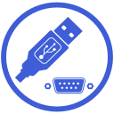

#  UsbSerialForAndroid
[](https://www.nuget.org/packages/UsbSerialForAndroid)

This is a .NET driver library to allow your Microsoft Android app to communicate with many common USB serial hardware. It uses the [Android USB Host API](http://developer.android.com/guide/topics/connectivity/usb/host.html)
available on Android 3.1+.

No root access, ADK, or special kernel drivers are required; all drivers are implemented in
C#. You get a raw serial port with `Read()`, `Write()`, and other basic
functions for use with your own protocols. The appropriate driver is picked based on the device's Vendor ID and Product ID.

This is a C# port of Mike Wakerly's Java [usb-serial-for-android](https://github.com/mik3y/usb-serial-for-android) library. It followed that library very closely when it was ported. The main changes were to make the method names follow C# standard naming conventions. Some Java specific data types were replaced with .NET types and the reflection code is .NET specific. Code examples written for the Java version of the library should translate more or less faithfully to C#.

It also includes code derived from a portion of LusoVU's [XamarinUsbSerial](https://bitbucket.org/lusovu/xamarinusbserial) library. XamarinUsbSerial was a C# wrapper for the Java usb-serial-for-android. It used an older version of the usb-serial-for-android .jar file. Only the C# code was used, the Java library is not referenced. 

This library supports .NET 10 and Microsoft Android. Support for Xamarin Android and previous versions of .NET have been dropped. The original Xamarin sample application has been replaced with a new app demo. If you need the old demo or want to support older versions of .NET, please use [version 1.1.1](https://github.com/anotherlab/UsbSerialForAndroid/releases/tag/v1.1.1).

## Breaking changes
I cleaned up the code in order to publish this as a nuget package. Someone created a nuget package based on a two year old version of this code base and published to nuget under their own name (and without credit to the original authors). I changed the root namespace from `Hoho.Android.UsbSerial` to `Anotherlab.UsbSerialForAndroid` to make it easier to manage on nuget. 

The "Hoho" namespace came from original Java library package name, [usb-serial-for-android](https://github.com/mik3y/usb-serial-for-android), and while I based this code from that library, they are separate.

## Structure

This solution contains two projects and a slnx solution file.

* UsbSerialForAndroid - A port of the Java library usb-serial-for-android
* UsbSerialForAndroidDemo - A Microsoft Android version of the example app that comes with usb-serial-for-android


The original demo and the .sln format solution file were deprecated and removed removed prior to this release. As mentioned above, the last version of those files were in in [version 1.1.1](https://github.com/anotherlab/UsbSerialForAndroid/releases/tag/v1.1.1).

## Getting Started
**1.** Grab the package from [nuget](https://www.nuget.org/packages/UsbSerialForAndroid). You can clone or download the repo and Reference the library to your project.

**2.** Copy the [device_filter.axml](https://github.com/anotherlab/UsbSerialForAndroid/blob/main/UsbSerialForAndroidDemo/Resources/xml/device_filter.xml) from the example app to your Resources/xml folder. Make sure that the Build Action is set to AndroidResource

**3.** Add the following attribute to the main activity to enable the USB Host
```C#
[assembly: UsesFeature("android.hardware.usb.host")]
```

**4.** Add the following IntentFilter to the main activity to receive USB device attached notifications
```C#
[IntentFilter(new[] { UsbManager.ActionUsbDeviceAttached })]
```

**5.** Add the MetaData attribute to associate the device_filter with the USB attached event to only see the devices that we are looking for
```C#
[MetaData(UsbManager.ActionUsbDeviceAttached, Resource = "@xml/device_filter")]
```

**6.** Refer to [MainActivity.cs](https://github.com/anotherlab/UsbSerialForAndroid/blob/main/UsbSerialForAndroidDemo/MainActivity.cs) in the example app to see how connect to a serial device and read data from it.

## Working with unrecognized devices
The UsbSerialForAndroid library has been compiled with the Vendor ID/Product ID pairs for many common serial devices. If you have a device that is not defined by the library, but will work with one of the drivers, you can manually add the VID/PID pair. If you have a device that is not in the GetSupportedDevices() method for that driver, you can submit a pull request that adds the vendor and product IDs to that driver.

UsbSerialProber is a class to help you find and instantiate compatible UsbSerialDrivers from the tree of connected UsbDevices. Normally, you will use the default prober returned by ``UsbSerialProber.getDefaultProber()``, which uses the built-in list of well-known VIDs and PIDs that are supported by our drivers.

To use your own set of rules, create and use a custom prober:

```C#
// Probe for our custom CDC devices, which use VID 0x1234
// and PIDS 0x0001 and 0x0002.
var table = UsbSerialProber.DefaultProbeTable;
table.AddProduct(0x1b4f, 0x0008, typeof(CdcAcmSerialDriver)); // IOIO OTG

table.AddProduct(0x09D8, 0x0420, typeof(CdcAcmSerialDriver)); // Elatec TWN4

var prober = new UsbSerialProber(table);
List<UsbSerialDriver> drivers = prober.FindAllDrivers(usbManager);
// ...
```

Of course, nothing requires you to use UsbSerialProber at all: you can instantiate driver classes directly if you know what you're doing; just supply a compatible UsbDevice.


## Compatible Serial Chipsets

* FTDI:  
FT232R, FT2232H, FT4232H, FT232H, FT230X, FT231X, FT234XD
* CP210x:   
UART Bridge, CP2102, CP2105, CP2108
* Prolific PL2303:   
PL2303HX, PL2303HXD, PL2303TA, PL2303GC, PL2303GB, PL2303GT, PL2303GL, PL2303GE, PL2303GS
* Qinheng CH34x:   
CH340, CH341A
* CDC Driver:   
Arduino, Teensyduino, Atmel Lufa, ARM mbed, ST CDC, Raspberry Pi Pico Micropython, Raspberry Pi Pico SDK, Qinheng CH9102F, IOIO OTG, Elatec TWN4 OTG

Additional devices can be easily added.

## Additional information

This is a port of the [usb-serial-for-android](https://github.com/mik3y/usb-serial-for-android) library and code examples written for it can be adapted to C# without much effort.

For common problems, see the
[Troubleshooting](https://github.com/mik3y/usb-serial-for-android/wiki/Troubleshooting)
wiki page for usb-serial-for-android library. For other help and discussion, please join the usb-serial-for-android Google Group,
[usb-serial-for-android](https://groups.google.com/forum/?fromgroups#!forum/usb-serial-for-android).  These two resources are for the Android Java version, but this library is port of that code base.

Pull Requests are welcome, but please include what hardware was used for testing. We do not have the hardware or the bandwidth to test the various chipsets supported by the library.

We will do our best to respond to reported issues. If you have a code fix or suggestion, we are only looking at changes submitted as pull requests.

For more information about contributing or reporting an issue, please see [CONTRIBUTING.md](https://github.com/anotherlab/UsbSerialForAndroid/blob/main/CONTRIBUTING.md) for more information for what we are looking for and how to get started.

## Author, License, and Copyright

This library is licensed under the MIT License. Please see [LICENSE.txt](https://github.com/anotherlab/UsbSerialForAndroid/blob/main/LICENSE.txt) for the complete license.

Copyright 2017, Tyler Technologies. All Rights Reserved. Portions of this library are based on the [usb-serial-for-android](https://github.com/mik3y/usb-serial-for-android) and [XamarinUsbSerial](https://bitbucket.org/lusovu/xamarinusbserial) libraries. Their rights remain intact.

The icon used for the repo, nuget package, and demo app was derived from [Serial to USB by Bonegolem](https://thenounproject.com/browse/icons/term/serial-to-usb/) (CC BY 3.0)
